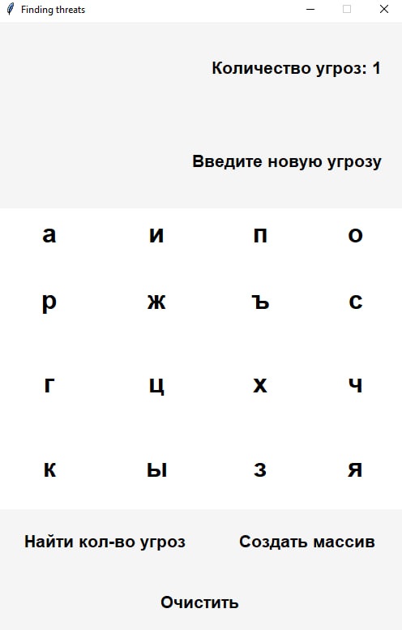

# Function approximation and Threat detection
### Studying at university (spring 2023)

This repository contains two projects:

1. **Function approximation and interpolation**
2. **Threat detection**

## Project 1: Function approximation and interpolation

### Description

This project is an application for function approximation and interpolation using `tkinter` for the graphical user interface and `numpy` for calculations. The program allows users to enter approximation nodes and function values at these nodes, and then plots linear, quadratic, and cubic approximation graphs.

### Features

- **Linear approximation**: Fit a linear polynomial to the given data.
- **Quadratic approximation**: Fit a quadratic polynomial.
- **Cubic approximation**: Fit a cubic polynomial.
- **Visualization**: Plot the original data and approximation functions.

### Usage

1. After launching the application, a window will appear with fields for entering nodes and function values.
2. Enter the approximation nodes and function values in the respective text fields.
3. Click the **Approximate function** button to perform approximation.
4. The result will be displayed as graphs of linear, quadratic, and cubic approximations.

## Project 2: Threat detection

### Description

This project is an application for finding threats in a random stream of letters. It uses `tkinter` to create the graphical interface. The program allows the user to create a random array of strings and search for specific threats within it.

### Features

- **Create array**: Generate an array of random strings.
- **Find threats**: Search for a specified threat in the generated array.
- **Clear**: Clear the current state and data.

### Usage

1. After launching the application, a window will appear with buttons to create an array, find threats, and clear data.
2. Click the **Create array** button to generate a random array of strings.
3. Enter a threat in the text field and click the **Find number of threats** button to find how many times the threat appears in the array.
4. Use the **Clear** button to reset the current state.

### Installation and running

1. **Clone the repository:**
    ```bash
    git clone https://github.com/account_name/name_repository.git
    ```

2. **Navigate to the project directory:**
    ```bash
    cd name_repository
    ```

3. **Ensure required modules are installed:**
    Install the necessary modules using pip:
    ```bash
    pip install tkinter matplotlib numpy
    ```

4. **Run the script:**
    Open your command line or terminal and execute:
    ```bash
    python3 file_name.py
    ```


### Screenshots

#### Function approximation 


#### Threat detection




## Notes

- Ensure that all dependencies are installed and working.
- The projects require `matplotlib`, `numpy`, and `tk` modules.

